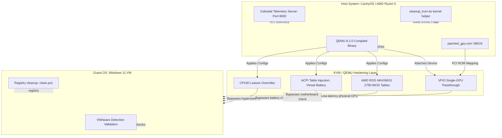
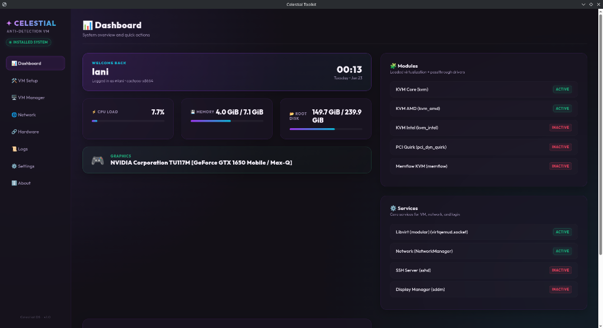

# Poof: Hardened KVM & QEMU Stealth Hypervisor Environment

An educational security analysis and implementation suite for running virtualized systems under high-strength stealth profiles. This repository serves as a portfolio of custom patches, tooling, guest-side cleanup scripts, and a real-time host-guest orchestration telemetry dashboard built over a 2-month development cycle.

The objective of this project is to achieve `0/91` detections on public hypervisor verification tools (e.g., VMAware) by systematically mapping hardware layouts, spoofing hardware registry structures, and resolving virtualization timing side-channels.

---

## Technical Highlights & Architecture

The following diagram illustrates the VM isolation pipeline, hardware resource mapping, and telemetry feedback loop established in this project:

---

## 1. Core Hardening Techniques

### A. Kernel-Level CPUID Intercept Spoofing
Standard KVM hypervisors expose their presence via specific CPUID leaves and instruction timings. The [patcher.py](host/scripts/patcher.py) script automates kernel source modifications to strip the hypervisor presence indicator:
* **Leaf 0x1 ECX**: Clears the hypervisor present bit (Bit 31) so guests register physical CPU characteristics directly.
* **Leaves 0x40000000 - 0x400000FF**: Mocks hypervisor leaves to return `0` across EAX, EBX, ECX, and EDX.
* **Leaf 7 EDX**: Masks capabilities bits to prevent automated guest queries from scanning host security capability registers.

### B. QEMU Hardware Spoofing
Using custom source-level patching, the QEMU target files (SMBIOS, disk controllers, NICs, and audio drivers) are modified prior to compilation via `patcher.py`:
* **Disk Emulation (SATA/NVMe/SCSI)**: Replaces default `QEMU` vendor and product strings in controller tables with common consumer drive strings (e.g., `S3FNX0GB418903Y` serials).
* **Intel e1000e NIC**: Changes subsystem vendor and device IDs globally to bypass standard emulation blacklists.
* **Intel HDA Audio**: Spoofs sub-manufacturer IDs to resemble onboard Realtek chipsets.
* **ACPI Table Builder**: Hardcodes `BOCHS` table signatures to match Asus SMBIOS configurations.

### C. ACPI Table Injection (Battery & AC Emulation)
VMs typically lack battery devices, which is a major detection point for anti-cheats scanning laptops or portable machines. We compile and inject a custom SSDT table [ssdt.asl](ssdt/ssdt.asl):
* Emulates an AC adapter (`ACAD`) returning status `0x0F` (plugged-in).
* Emulates a battery device (`BAT0`) returning standard battery informational structures (`_BIF`) and dynamic charge status (`_BST`).

### D. Single-GPU Passthrough (VFIO)
To ensure direct, bare-metal graphics performance, we isolate the host's secondary GPU and pass it directly to the VM:
* **VFIO Configuration**: Kernel parameters loaded via early ramdisk config [mkinitcpio.conf](host/config/mkinitcpio.conf) and [vfio.conf](host/config/vfio.conf).
* **VBIOS Patched ROM**: Uses [dump_and_patch_rom.py](host/scripts/dump_and_patch_rom.py) to read the host GPU's VBIOS, strip standard header initialization headers, and feed the cleaned ROM directly to libvirt hostdev.
* **Dispatch Hooks**: Libvirt VM lifecycle scripts [start.sh](host/hooks/qemu.d/win11-gaming/prepare/begin/start.sh) and [revert.sh](host/hooks/qemu.d/win11-gaming/release/end/revert.sh) handled by [qemu-hook-dispatcher](host/hooks/qemu-hook-dispatcher) dynamically allocate and release GPU resources during VM start and shutdown cycles.

---

## 2. Telemetry Dashboard (Celestial Toolkit)

To monitor host resources, active VM states, dynamic display configurations, and launch deployment scripts, we created the **Celestial Toolkit**:

* **Backend Telemetry API Server ([celestial_backend.py](dashboard/celestial_backend.py))**: A custom Python HTTP server exposing endpoints for real-time CPU utilization, active system RAM, host networking data, CPU temperature, disk usage, active VM statuses, and sub-process task logs.
* **Responsive Frontend ([index.html](dashboard/index.html))**: A sleek, dark-themed glassmorphism console styled with vanilla CSS. It includes:
  - Real-time animated canvas graphics representing system throughput.
  - Interactive triggers to launch and control the VM instances.
  - Visual status blocks highlighting system specs, GPU temperatures, and hypervisor details.
  - An interactive terminal log output relaying direct virtual machine deployment logs.
* **App Shell Launcher ([launch.sh](dashboard/launch.sh))**: A bash helper launching the UI using local chromium-based applications in standalone application window layouts.

---

## 3. Repository Contents

### Host Infrastructure
* [host/config/](host/config/): Standard configuration templates for host AMD settings (`kvm.conf`), GPU isolation (`vfio.conf`), and shared memory allocations (`10-looking-glass.conf`).
* [host/hooks/](host/hooks/): Automatic hardware switching hooks executed dynamically on guest execution life cycles.
* [host/scripts/](host/scripts/): Build scripts for QEMU, EDK2/OVMF, and Kernel configurations. Includes `patcher.py` and display toggling utilities.

### Guest Support
* [guest/clean_registry.ps1](guest/clean_registry.ps1): Guest registry cleaner. Must be run inside the Windows guest system with administrative privileges to clear stale PCI registry keys mapping back to QEMU hardware paths.
* [guest/run.bat](guest/run.bat): Batch script wrapper to bypass standard Windows execution policies and trigger registry cleanup.

---

## Bibliography & References

Academic and community resources used during development:

1. **Nika (Reference Base)**: Custom QEMU patch patterns, OVMF configurations, memory mapping templates, and SSDT tables.
2. **VMAware**: Hypervisor verification checking scripts.
3. **Looking Glass Project**: Ultra low-latency Framebuffer shared memory interface between host and guest.
4. **CachyOS Distribution**: Arch-linux derivate optimized with custom kernel patches (e.g. BBR, AMD-Pstate) serving as the virtualization host system.
